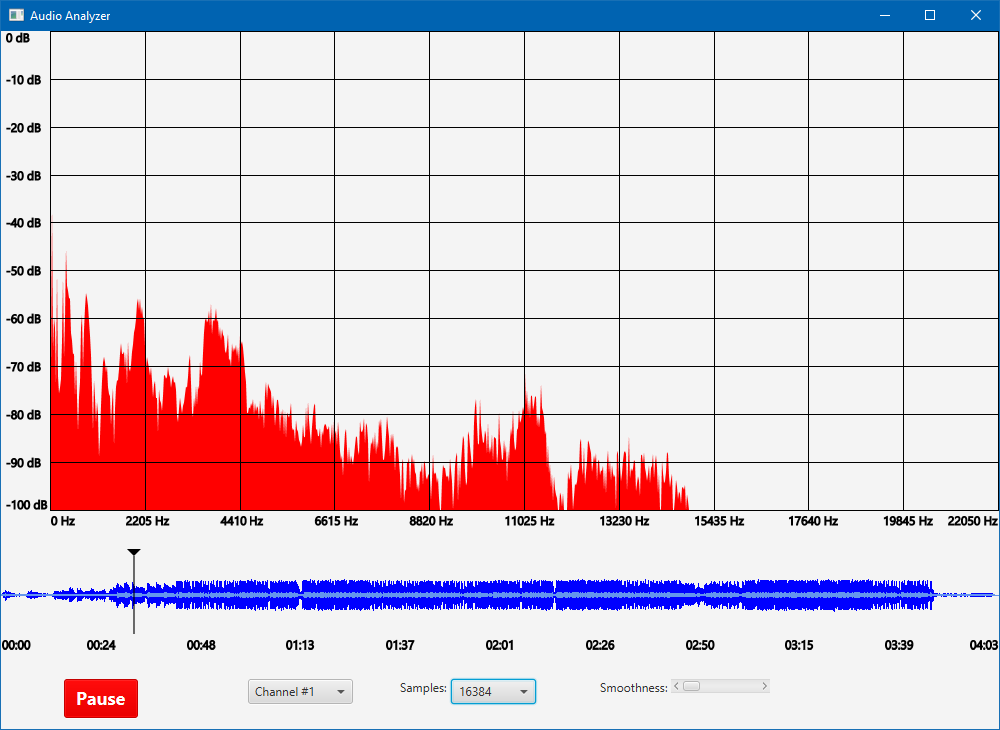
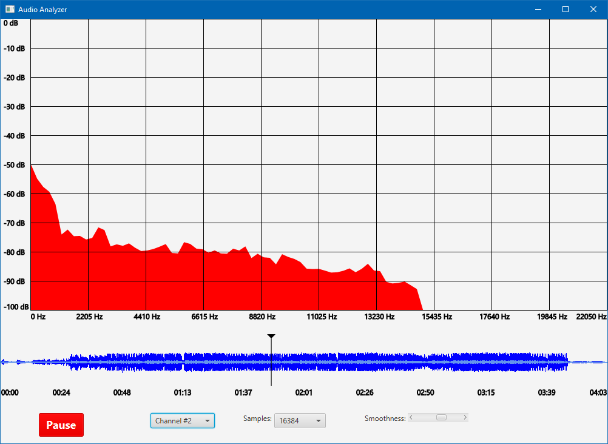

# AudioAnalyzer
---

**AudioAnalyzer** is a small JavaFX desktop application for plotting audio signal frequency spectrum in the real time.

Download here: https://github.com/SzymonKatra/AudioAnalyzer/releases.  
Requires **[ffmpeg](https://www.ffmpeg.org/)** installed in order to decode and demux audio files.

## Features:
- audio playback with real-time spectrum plotting
- multiple channels support
- analysis of different number of samples
- waveform preview
- graph smoothing
- supports all audio formats which ffmpeg can decode

## Screenshots:

## License:
MIT